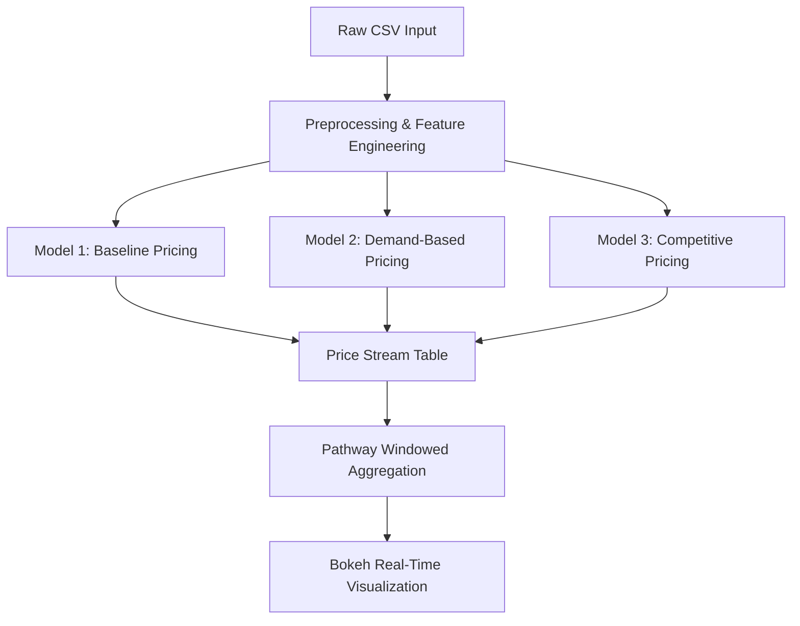

# Dynamic Pricing Lots - Real-Time Data Processing

> **Capstone Project - Summer Analytics 2025**  
> Author: **Dhairya Pandya**  
> Repository: `Dynamic Pricing Lots - Real-Time Data Processing`

---

## 🚀 Objective

To build a real-time intelligent pricing engine for 14 urban parking lots that:
- Adjusts prices dynamically based on demand, traffic, and other features
- Processes data as live streams using **Pathway**
- Visualizes pricing trends in real time using **Bokeh**
- Implements multiple models with increasing sophistication

---

## 🧠 Models Implemented

### 🔹 Model 1 – Baseline Linear Model

> A simple model based on real-time occupancy levels.

**Formula:**
\[
\text{Price}_t = \text{BasePrice} + \alpha \cdot \min\left( \frac{\text{Occupancy}}{\text{Capacity}}, 1 \right)
\]

- Base price: $10  
- α (alpha): scaling constant (e.g. 5)  
- Clipped to: $[10, 15]  
- Updates every stream step using Pathway.

---

### 🔹 Model 2 – Demand-Based Pricing (Advanced)

> Considers multiple real-world features influencing demand.

**Demand Function:**
\[
D = \alpha \cdot \left(\frac{\text{Occupancy}}{\text{Capacity}}\right) + \beta \cdot \text{QueueLength} - \gamma \cdot \text{TrafficLevel} + \delta \cdot \text{SpecialDay} + \epsilon \cdot \text{VehicleTypeWeight}
\]

**Pricing Rule:**
\[
\text{Price}_t = \text{BasePrice} \cdot (1 + \lambda \cdot \text{NormalizedDemand})
\]

- Demand is normalized in range [-1, 1]
- λ (lambda): amplification factor
- Final price bounded within `[Base × 0.5, Base × 2]`

---

### 🔹 Model 3 – Competitive Pricing Model (Optional)

> Introduces **location awareness** and **rerouting logic**.

**Logic:**
- Compute distance between lots using Haversine formula
- If a lot is full but nearby lots are cheaper and not full → reroute
- If nearby lots are costlier → increase price slightly

**Formula (Conceptual):**
\[
\text{Price}_t = f(\text{OwnDemand}, \text{CompetitorPrices}, \text{Proximity})
\]

---

## 📦 Dataset Info

- 14 parking lots × 73 days × 18 time steps/day
- Features:
  - `Occupancy`, `Capacity`, `QueueLength`
  - `TrafficConditionNearby`, `IsSpecialDay`
  - `VehicleType` (car, bike, truck)
  - `Latitude`, `Longitude` (for competition modeling)

---

## 🧱 System Architecture (Mermaid)



---

## 🛠️ Technologies Used

- **📊 Bokeh** – interactive time-series plots
- **⚡ Pathway** – for real-time stream simulation
- **🧮 Numpy & Pandas** – all models implemented from scratch
- **📁 Google Colab** – runtime environment

---

## 📈 Visualization Strategy

- **Real-time line plots** for each parking space
- Snapshots generated using `head()` after `pw.run()`
- Plotted with custom function `plot_snapshot(...)`
- Supports comparison across all lots or specific ones

---

## ✅ Output Example

| Time          | SystemCodeNumber | Price ($) |
|---------------|------------------|-----------|
| 2025-07-01 08:00 | BHMBCCMKT01      | 12.50     |
| 2025-07-01 08:30 | BHMBCCMKT01      | 13.10     |

---

## 📍 How to Run

```python
# After executing all model logic
pw.run()

# Then fetch and plot
output_df = result.head(1000)
plot_snapshot(output_df.to_dict('records'))
```

---

## 📚 Future Enhancements

- Model 2 parameter tuning (based on actual demand curves)
- Model 3: Fully integrated rerouting logic and competitor pricing
- Live deployment via `Panel` + `ngrok` or `FastAPI`
