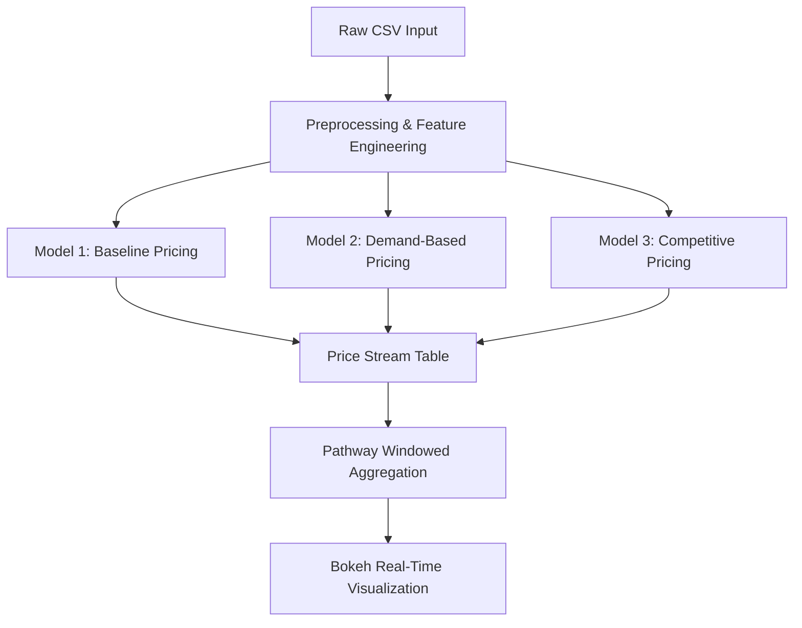

# Dynamic Pricing Lots - Real-Time Data Processing

> **Capstone Project - Summer Analytics 2025**  
> Author: **Dhairya Pandya**  
> Repository: `Dynamic Pricing Lots - Real-Time Data Processing`

---

## 🚀 Objective

To build a real-time intelligent pricing engine for 14 urban parking lots that:
- Adjusts prices dynamically based on demand, traffic, and other features
- Processes data as live streams using **Pathway**
- Visualizes pricing trends in real time using **Bokeh**
- Implements multiple models with increasing sophistication

---

## 🧠 Models Implemented

### 🔹 Model 1 – Baseline Linear Model

> A simple model based on real-time occupancy levels.

**Formula (Readable):**  
`Price_t = BasePrice + α × min(Occupancy / Capacity, 1)`

**Rendered Formula:**  
)

- Base price: $10  
- α (alpha): scaling constant (e.g. 5)  
- Clipped to: $[10, 15]  
- Updates every stream step using Pathway.

---

### 🔹 Model 2 – Demand-Based Pricing (Advanced)

> Considers multiple real-world features influencing demand.

**Demand Function (Readable):**  
`D = α × (Occupancy / Capacity) + β × QueueLength - γ × TrafficLevel + δ × SpecialDay + ε × VehicleTypeWeight`

**Rendered Formula:**  
%20%2B%20%5Cbeta%20%5Ccdot%20QueueLength%20-%20%5Cgamma%20%5Ccdot%20TrafficLevel%20%2B%20%5Cdelta%20%5Ccdot%20SpecialDay%20%2B%20%5Cepsilon%20%5Ccdot%20VehicleTypeWeight)

**Pricing Rule (Readable):**  
`Price_t = BasePrice × (1 + λ × NormalizedDemand)`

**Rendered Formula:**  


---

### 🔹 Model 3 – Competitive Pricing Model (Optional)

> Introduces **location awareness** and **rerouting logic**.

**Conceptual Rule:**  
`Price_t = f(OwnDemand, CompetitorPrices, Proximity)`

---

## 📦 Dataset Info

- 14 parking lots × 73 days × 18 time steps/day
- Features:
  - `Occupancy`, `Capacity`, `QueueLength`
  - `TrafficConditionNearby`, `IsSpecialDay`
  - `VehicleType` (car, bike, truck)
  - `Latitude`, `Longitude` (for competition modeling)

---

## 🧱 System Architecture (Mermaid)



---

## 🛠️ Technologies Used

- **📊 Bokeh** – interactive time-series plots
- **⚡ Pathway** – for real-time stream simulation
- **🧮 Numpy & Pandas** – all models implemented from scratch
- **📁 Google Colab** – runtime environment

---

## 📈 Visualization Strategy

- **Real-time line plots** for each parking space
- Snapshots generated using `head()` after `pw.run()`
- Plotted with custom function `plot_snapshot(...)`
- Supports comparison across all lots or specific ones

---

## ✅ Output Example

| Time              | SystemCodeNumber | Price ($) |
|-------------------|------------------|-----------|
| 2025-07-01 08:00  | BHMBCCMKT01      | 12.50     |
| 2025-07-01 08:30  | BHMBCCMKT01      | 13.10     |

---

## 📍 How to Run

```python
# After executing all model logic
pw.run()

```

---
